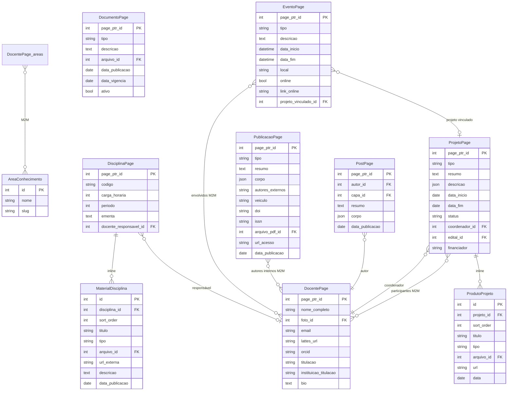

# DATABASE.md — Portal Agronomia IFSertãoPE

## Tecnologia

PostgreSQL 16. O Wagtail usa o banco para full-text search nativo e para armazenar StreamField como JSON.

## Diagrama ER



## Tabelas por App

### `pessoas` — AreaConhecimento
| Campo | Tipo | Restrições |
|---|---|---|
| id | BigAutoField | PK |
| nome | CharField(100) | NOT NULL |
| slug | SlugField | UNIQUE, NOT NULL |

### `pessoas` — DocentePage (herda `wagtailcore_page`)
| Campo | Tipo | Restrições |
|---|---|---|
| page_ptr_id | FK → wagtailcore_page | PK |
| nome_completo | CharField(200) | NOT NULL |
| foto_id | FK → wagtailimages_image | NULL |
| email | EmailField | NOT NULL |
| lattes_url | URLField | blank |
| orcid | CharField(20) | blank |
| titulacao | CharField(20) | choices |
| instituicao_titulacao | CharField(200) | NOT NULL |
| bio | RichTextField | NOT NULL |

M2M: `DocentePage_areas_conhecimento` ↔ `AreaConhecimento`

### `ensino` — DisciplinaPage
| Campo | Tipo | Restrições |
|---|---|---|
| page_ptr_id | FK → wagtailcore_page | PK |
| codigo | CharField(20) | NOT NULL |
| carga_horaria | PositiveIntegerField | NOT NULL |
| periodo | PositiveSmallIntegerField | 1–10 |
| ementa | RichTextField | NOT NULL |
| docente_responsavel_id | FK → DocentePage | NULL, SET_NULL |

### `ensino` — MaterialDisciplina (Orderable)
| Campo | Tipo | Restrições |
|---|---|---|
| id | BigAutoField | PK |
| disciplina_id | FK → DisciplinaPage | CASCADE |
| sort_order | IntegerField | Orderable |
| titulo | CharField(200) | NOT NULL |
| tipo | CharField(20) | choices |
| arquivo_id | FK → wagtaildocs_document | NULL |
| url_externa | URLField | blank |
| descricao | TextField | blank |
| data_publicacao | DateField | NOT NULL |

### `pesquisa` — ProjetoPage
| Campo | Tipo | Restrições |
|---|---|---|
| page_ptr_id | FK → wagtailcore_page | PK |
| tipo | CharField(20) | choices |
| resumo | TextField(250) | NOT NULL |
| descricao | JSONField (StreamField) | blank |
| data_inicio | DateField | NOT NULL |
| data_fim | DateField | NULL |
| status | CharField(20) | choices, default `em_andamento` |
| coordenador_id | FK → DocentePage | PROTECT |
| edital_id | FK → wagtaildocs_document | NULL |
| financiador | CharField(200) | blank |

M2M: `ProjetoPage_participantes_docentes` ↔ `DocentePage`

### `pesquisa` — ProdutoProjeto (Orderable)
| Campo | Tipo |
|---|---|
| id | BigAutoField |
| projeto_id | FK → ProjetoPage CASCADE |
| sort_order | IntegerField |
| titulo | CharField(200) |
| tipo | CharField(20) choices |
| arquivo_id | FK → wagtaildocs_document NULL |
| url | URLField blank |
| data | DateField |

### `pesquisa` — PublicacaoPage
| Campo | Tipo | Restrições |
|---|---|---|
| page_ptr_id | FK → wagtailcore_page | PK |
| tipo | CharField(30) | choices |
| resumo | TextField | NOT NULL |
| corpo | JSONField (StreamField) | blank |
| autores_externos | CharField(500) | blank |
| veiculo | CharField(300) | NOT NULL |
| doi | CharField(100) | blank |
| issn | CharField(20) | blank |
| arquivo_pdf_id | FK → wagtaildocs_document | NULL |
| url_acesso | URLField | blank |
| data_publicacao | DateField | NOT NULL |

M2M: `PublicacaoPage_autores_internos` ↔ `DocentePage`

### `noticias` — PostPage
| Campo | Tipo | Restrições |
|---|---|---|
| page_ptr_id | FK → wagtailcore_page | PK |
| autor_id | FK → DocentePage | PROTECT |
| capa_id | FK → wagtailimages_image | NULL |
| resumo | TextField(200) | NOT NULL |
| corpo | JSONField (StreamField) | NOT NULL |
| data_publicacao | DateField | auto_now_add |

### `institucional` — DocumentoPage
| Campo | Tipo | Restrições |
|---|---|---|
| page_ptr_id | FK → wagtailcore_page | PK |
| tipo | CharField(20) | choices |
| descricao | TextField | blank |
| arquivo_id | FK → wagtaildocs_document | PROTECT |
| data_publicacao | DateField | NOT NULL |
| data_vigencia | DateField | NULL |
| ativo | BooleanField | default True |

### `institucional` — EventoPage
| Campo | Tipo | Restrições |
|---|---|---|
| page_ptr_id | FK → wagtailcore_page | PK |
| tipo | CharField(20) | choices |
| descricao | RichTextField | NOT NULL |
| data_inicio | DateTimeField | NOT NULL |
| data_fim | DateTimeField | NULL |
| local | CharField(300) | NOT NULL |
| online | BooleanField | default False |
| link_online | URLField | blank |
| projeto_vinculado_id | FK → ProjetoPage | NULL, SET_NULL |

M2M: `EventoPage_docentes_envolvidos` ↔ `DocentePage`

## Índices Relevantes

O Wagtail cria automaticamente índices em `wagtailcore_page` para:
- `slug` (UNIQUE dentro do site)
- `path` (UNIQUE, estrutura em árvore via LTREE-like)
- `live`, `depth`, `locale_id`

Para busca textual, o Wagtail usa `wagtailsearch_indexentry` com suporte a `SearchVectorField` do PostgreSQL.

## Migrações

Cada app tem sua própria pasta `migrations/`. Ordem de aplicação (já refletida nas migrações):

```bash
# Aplica todas as migrações de uma vez
docker compose exec web python manage.py migrate
```

Para criar novas migrações após alterar models:

```bash
docker compose exec web python manage.py makemigrations
docker compose exec web python manage.py migrate
```

## Backup e Restore

```bash
# Backup
docker compose exec db pg_dump -U postgres portal_agronomia > backup_$(date +%Y%m%d).sql

# Restore
docker compose exec -T db psql -U postgres portal_agronomia < backup_YYYYMMDD.sql
```

Arquivos de mídia (uploads):

```bash
# Backup do volume de mídia
docker run --rm -v portal-agronomia_media_data:/data -v $(pwd):/backup \
  alpine tar czf /backup/media_backup.tar.gz /data
```

## Seeds

Após migrate, configure os dados iniciais:

```bash
# Cria superusuário
docker compose exec web python manage.py createsuperuser

# Cria grupos e permissões
docker compose exec web python manage.py setup_grupos

# Cria a árvore de páginas (via Wagtail admin em /admin/)
# Ordem: HomePage → IndexPages → páginas filhas
```
